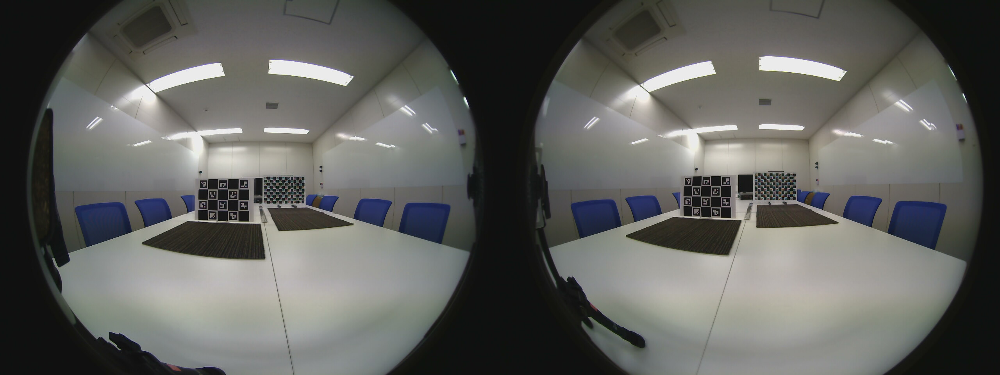
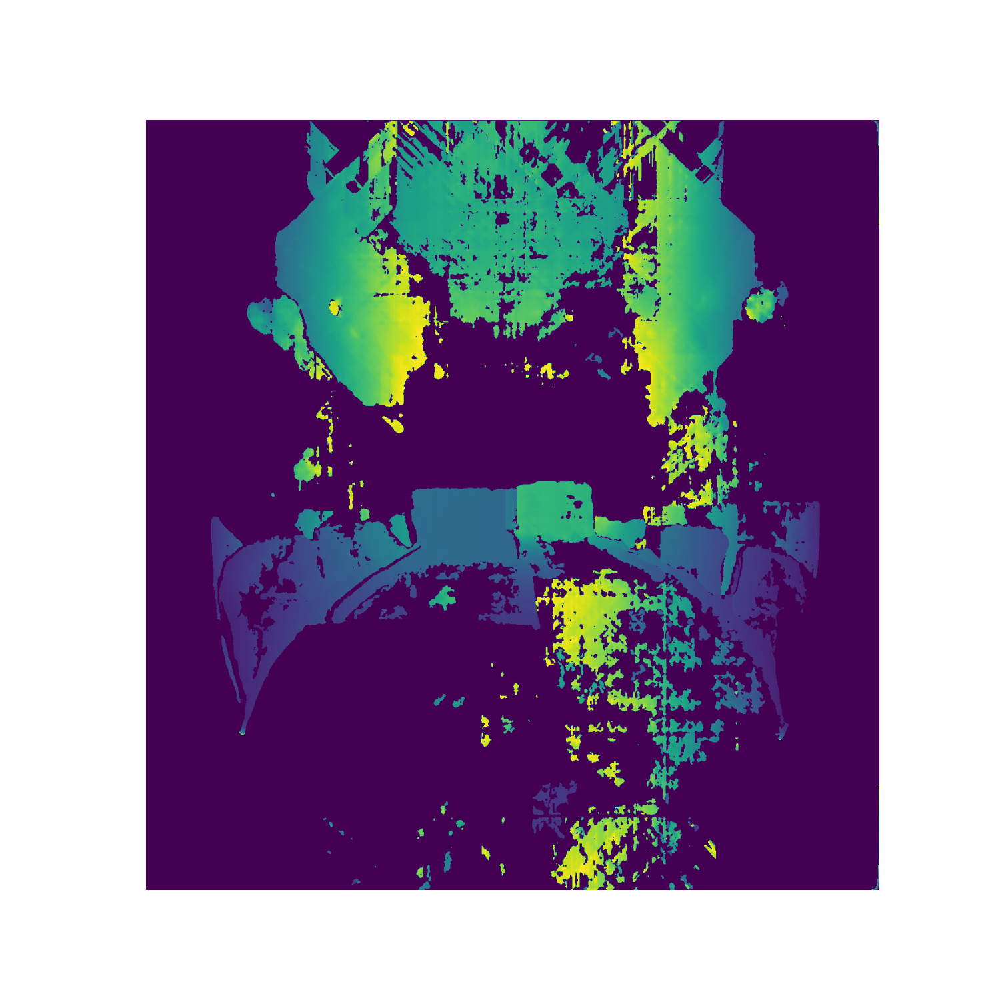
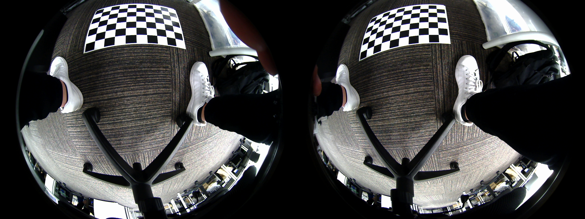
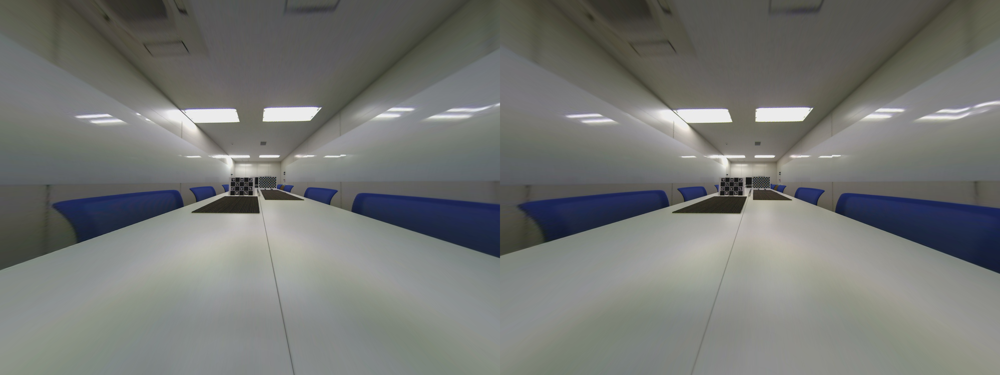

# Fisheye-Depth-Estimation
Depth estimation by fisheye stereo camera ([CaliCam® Fisheye Stereo Camera](https://astar.ai/products/stereo-camera))

## Environment
* Python 3.8
* OpneCV 4.2.0.32 (4.5.5 doesn`t work)

## run.py
Please set your parameters to run.py. Then
```
python run.py
```

## Result

* Original


* Depth (Aligned image)


## How does it work ?
Depth estimation with fisheye stereo camera requires some steps.
1. Stereo calibration
2. Image transformation
3. Disparity calculation

### Stereo calibration
First, in order to calculate the disparity between the two camera images, it is necessary to remove the distortions in fisheye cameras and align the parallel lines. 

 The necessary camera matrices can be obtained by photographing a particular checkerboard from various angles and applying a corner detection algorithm.

* Checkerboard


### Image transformation
The image is now clear of distortions and the parallel lines are aligned, but the center of the image is very small due to the characteristics of the fisheye lens. 

Equirectangular transformation improves the accuracy of the disparity calculation by solving the image area problem while maintaining the parallel lines.

Equirectangular is a graphical method used in world maps, where the axes are latitude and longitude.

* Right after parallel lines aligned


* After Equirectangular transformation


### Disparity calculation
Disparity calculation is performed on the transformed images. A image matching algorithm can be used to calculate disparity. The matching algorithm cannot calculate disparity well for areas with little texture.

* Disparity


Once the disparity has been calculated, all that remains is to convert it to depth using a simple formula.