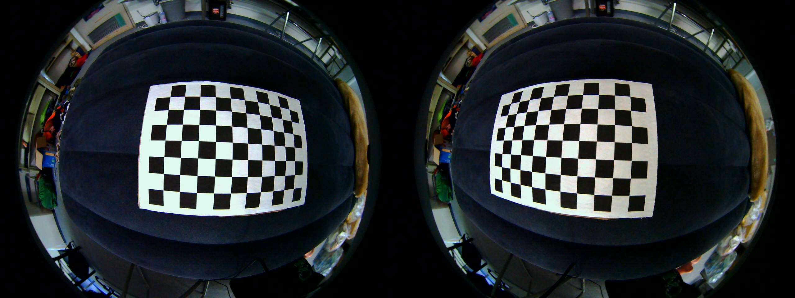
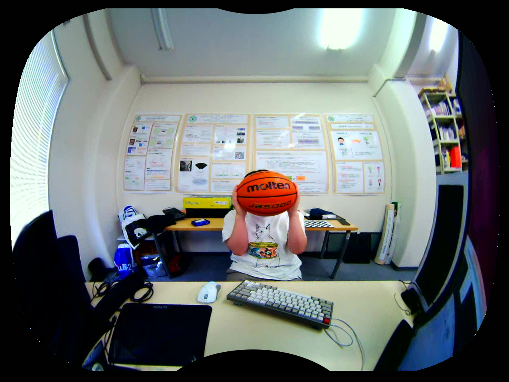
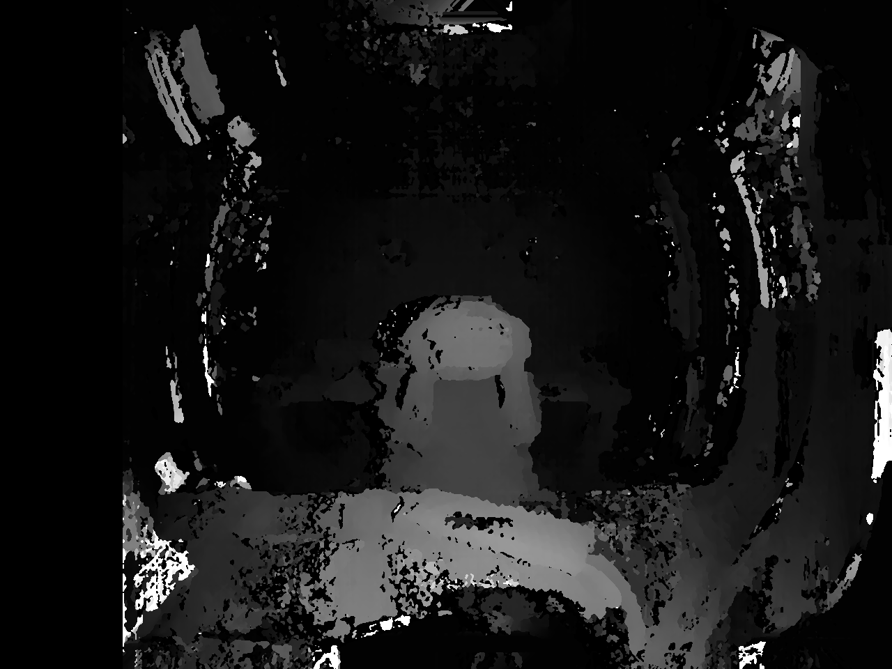
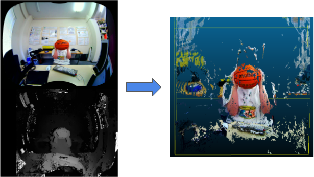
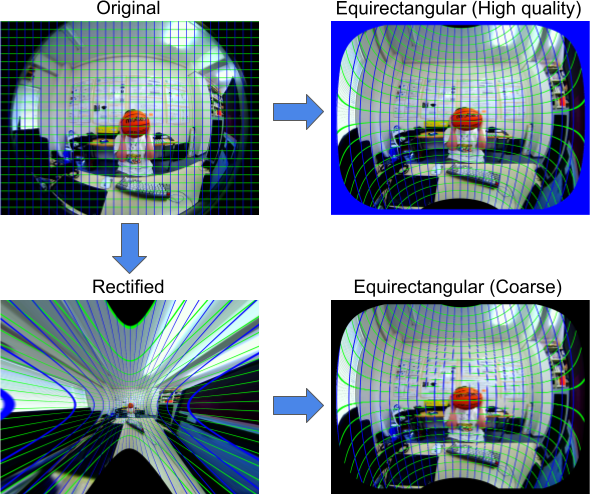

# Fisheye-Depth-Estimation

3D reconstruction by fisheye stereo camera ([CaliCam® Fisheye Camera](https://astar.ai))

Real-time & high quality fisheye stereo 3D reconstruction.


## Environment

* C++ 17
* CUDA 12.0
* OpneCV & OpenCV Contrib 4.11.0 (+CUDA option)
* VTK 9.3

OpenCV should be compiled with [OpenEXR](https://openexr.com/en/latest/).


## Build & Run

### Build

```bash
sh scripts/build.sh
```

### Calibration

To remove camera distortion and stereo recitfication, calibrate camera with checker board.

```bash
sh scripts/calib.sh
```

Currently, the calibration doesn't work with OpenCV 4.11.0. (it works with 4.2.0.)  
Please check following issue: https://github.com/opencv/opencv/issues/23962

Important note: The calibration doesn't work due to OpenCV issue at 4.11.0. (it works with 4.2.0.)

### Test 3D reconstruction

Before proceeding with real-time 3D reconstruction, verify the calibration results and parameters by testing a single-shot image.

```bash
sh scripts/reconstruct.sh
```

### Real-time stereo

```bash
sh scripts/realtime.sh
```

Some configurations required for each step. Check [config files](./configs/).


## Result

15~20FPS (i7-13700KF + RTX 4070)

* 3D viewer sample


## How does it work ?

Depth estimation with fisheye stereo camera requires some steps.

1. Stereo calibration
2. Image transformation
3. Disparity calculation
4. 3D reconstruction

### Stereo calibration

Firstly, to calculate the disparity between the images captured by two cameras, it's essential to correct the distortions inherent in fisheye cameras and align the parallel lines.

The required camera matrices can be acquired by photographing a specific checkerboard pattern from various angles and applying a corner detection algorithm.

* Checkerboard



### Image transformation

The image, now free from distortions and with aligned parallel lines, still exhibits a very small center due to the characteristics of the fisheye lens. 

The equirectangular transformation addresses this image area issue while preserving the alignment of parallel lines, improving the accuracy of the disparity calculation.

Equirectangular is a graphical method commonly used in world maps, where the axes correspond to latitude and longitude.

* Right after parallel lines aligned


* After Equirectangular transformation




### Disparity calculation
Disparity calculation is performed on the transformed images. A image matching algorithm can be used to calculate disparity. The matching algorithm cannot calculate disparity well for areas with little texture.

* Disparity



Once the disparity has been calculated, all that remains is to convert it to depth using a simple formula.

### 3D reconstruction

In the process of 3D reconstruction, we generate XYZRGB points from RGB images and disparity images.

The disparities derived from stereo matching of equirectangular images differ from the original disparities, so we convert them to the original disparities using coordinate mapping from equirectangular images to rectified images.

Similarly, we map the equirectangular RGB images to their recitfied coordinates before performing calculations. After the coordinate transformation, the method of creating a 3D point cloud from a standard image can be used.

* Image to Point Cloud




## Key Features

### Disparity

The clarity near the center of rectified and equirectangular images greatly differs, significantly impacting the accuracy of stereo matching.　While high-precision stereo matching is possible with rectified images if the image is enlarged, it results in increased computational load and is inefficient compared to equirectangular images.

* Rectified vs Equirectangular


### Transformation Map

The transformations from the original image to a rectified image, and from the rectified image to an equirectangular image, can both be represented by maps.

However, if we convert to an equirectangular image in the order of original image ⇒ rectified image ⇒ equirectangular image, the conversion to a rectified image causes the loss of central pixels, resulting in a coarse image.

Therefore, we combined the maps of the rectified conversion and the equirectangular conversion using cv::remap, making the transformation from the original image to an equirectangular image possible.

* High-quality equirectangular image




## For more detail

Detailed description of the algorithm here. (Japanese)

[Logic description (Qiita)](https://qiita.com/syunnsyunn74/items/155ee816f39691f021d2)

[Implement description (Qiita)](https://qiita.com/syunnsyunn74/items/6e248f7fbe87aa18e69d)
